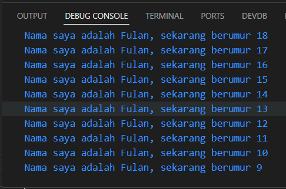

# **Pengantar Bahasa Pemrograman Dart - Bagian 1**

## Nama : Putra Zakaria Muzaki
## Kelas : TI-3H/19
## NIM : 2241720220 

<br>

**Soal 1**
<br> &emsp; Modifikasilah kode pada baris 3 di VS Code atau Editor Code favorit Anda berikut ini agar mendapatkan keluaran (output) sesuai yang diminta!
<br>Output yang diminta:
<br>


Jawaban:<br>
```
void main(List<String> args) {
  for (var i = 18; i >= 9; i--) {
    print('Nama saya adalah Fulan, sekarang berumur ${i}');
  }
}
```
Hasil Run:


**Soal 2**
<br> &emsp; Mengapa sangat penting untuk memahami bahasa pemrograman Dart sebelum kita menggunakan framework Flutter ? Jelaskan!

Jawaban:<br>
```
Karena Flutter adalah framework dari Dart, dimana pastinya Dart adalah inti dari framework Flutter, sehingga untuk memahami bahasa pemrograman Dart akan mempermudah untuk memahami cara kerja Flutter.  
```

**Soal 3**
<br> &emsp; Rangkumlah materi dari codelab ini menjadi poin-poin penting yang dapat Anda gunakan untuk membantu proses pengembangan aplikasi mobile menggunakan framework Flutter.

Jawaban:<br>
```
  
```