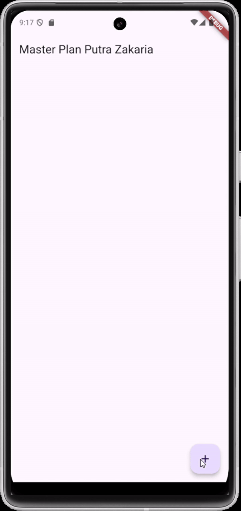
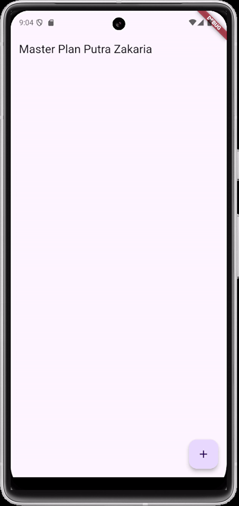
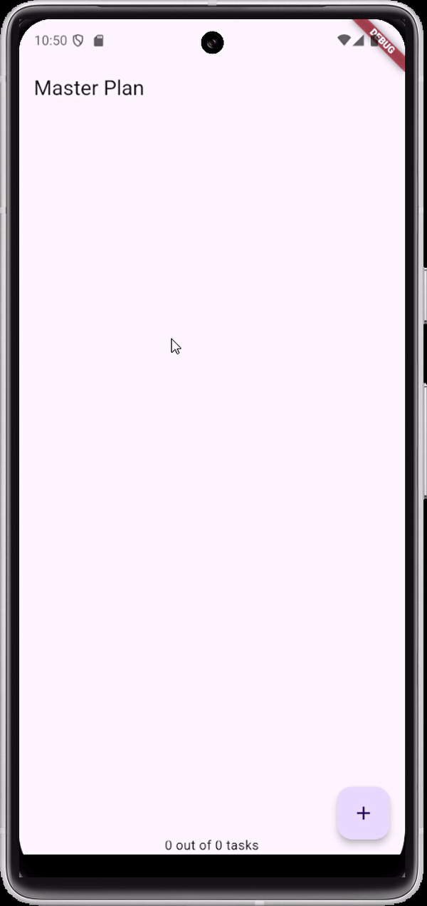
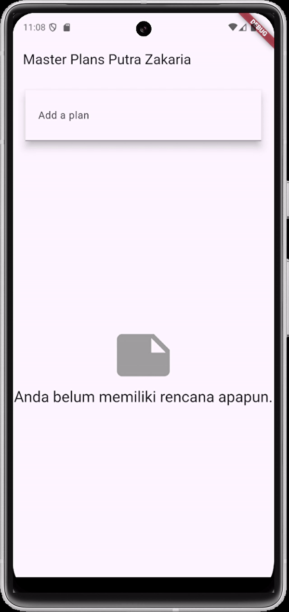

# master_plan

## Nama: Putra Zakaria Muzaki
## Kelas: TI-3H/19
## NIM: 2241720220

# Tugas Praktikum 1: Dasar State dengan Model-View

1. **Selesaikan langkah-langkah praktikum tersebut, lalu dokumentasikan berupa GIF hasil akhir praktikum beserta penjelasannya di file README.md! Jika Anda menemukan ada yang error atau tidak berjalan dengan baik, silakan diperbaiki.**
<br>
Hasil Praktikkum 1:


2. **Jelaskan maksud dari langkah 4 pada praktikum tersebut! Mengapa dilakukan demikian?**
    ```
    export 'plan.dart';
    export 'task.dart';
    ```
    pada langkah 4 dilakukan proses penambahan file data_layer.dart yang digunakan untuk membuat file data_layer.dart sebagai pusat untuk mengelola ekspor model-model yang digunakan, dalam hal ini plan.dart dan task.dart. Dengan mengekspor file model melalui satu file, kita memudahkan proses impor pada bagian lain aplikasi. Saat aplikasi berkembang, kita hanya perlu mengimpor data_layer.dart untuk mendapatkan akses ke model-model terkait, sehingga manajemen kode menjadi lebih rapi dan efisien.

3. **Mengapa perlu variabel plan di langkah 6 pada praktikum tersebut? Mengapa dibuat konstanta ?**
    <br>Variabel plan di langkah 6 merupakan instance dari class Plan yang digunakan untuk menyimpan dan mengelola data terkait rencana (plan) di dalam PlanScreen. Variabel ini dideklarasikan sebagai konstanta (const) karena pada awalnya ia hanya perlu diinisialisasi dengan nilai default dari Plan. Kemudian, selama aplikasi berjalan, nilai plan dapat diubah menggunakan setState() saat ada perubahan pada task. Pendekatan ini menjaga agar data tetap aman dan tidak mudah dimodifikasi sembarangan di luar konteks yang diizinkan.

4. **Lakukan capture hasil dari Langkah 9 berupa GIF, kemudian jelaskan apa yang telah Anda buat!**

    Pada langkah 9 dilakukan proses membuat widget _buildTaskTile, yang berfungsi menampilkan setiap task pada list plan.tasks secara dinamis dalam bentuk ListTile. Dengan begitu, setiap item pada daftar task dapat diedit atau ditandai sebagai "complete" secara terpisah. Setiap kali ada perubahan pada deskripsi atau status complete task, widget ini akan memperbarui plan menggunakan setState, memastikan tampilan aplikasi tetap sinkron dengan data.

    Hasil dari langkah ini akan menampilkan daftar task yang bisa diedit dan ditandai sebagai selesai oleh pengguna.
5. **Apa kegunaan method pada Langkah 11 dan 13 dalam lifecyle state ?**
    <br>Langkah 11 (initState): Method initState() dijalankan sekali saat PlanScreen diinisialisasi. Di sini, scrollController ditambahkan sebagai listener untuk mendeteksi perubahan scroll. Dengan ini, ketika pengguna menggulir layar, focus pada input yang aktif akan hilang otomatis, membantu mencegah input keyboard tetap aktif saat tidak diperlukan.
    <br>Langkah 13 (dispose): Method dispose() dijalankan saat PlanScreen akan dihancurkan dari memori. Pada method ini, scrollController.dispose() dipanggil untuk menghapus controller dari memori dan menghindari kebocoran memori. Method ini memastikan bahwa resource yang tidak lagi digunakan dibersihkan dengan benar.

# Tugas Praktikum 2: InheritedWidget

1. **Selesaikan langkah-langkah praktikum tersebut, lalu dokumentasikan berupa GIF hasil akhir praktikum beserta penjelasannya di file README.md! Jika Anda menemukan ada yang error atau tidak berjalan dengan baik, silakan diperbaiki sesuai dengan tujuan aplikasi tersebut dibuat.**


2. **Jelaskan mana yang dimaksud InheritedWidget pada langkah 1 tersebut! Mengapa yang digunakan InheritedNotifier?**
    <br> InheritedWidget pada langkah 1 adalah PlanProvider, yang dibuat sebagai subclass dari InheritedNotifier<ValueNotifier<Plan>>. PlanProvider bertindak sebagai "penyedia data" atau "state holder" yang menempatkan data model Plan dalam pohon widget sehingga dapat diakses oleh widget-widget anak (sub-widgets) yang membutuhkan data tersebut. InheritedNotifier digunakan karena kita ingin agar data Plan pada aplikasi diperbarui dan diberitahukan ke seluruh widget yang bergantung pada data tersebut setiap kali ada perubahan. Dengan InheritedNotifier, kita dapat menggunakan ValueNotifier<Plan> untuk memberi tahu perubahan data secara otomatis ke widget anak yang membutuhkan. ValueNotifier adalah mekanisme yang efisien untuk memberitahukan perubahan pada objek Plan tanpa memuat ulang seluruh pohon widget, sehingga ini meningkatkan efisiensi aplikasi.
3. **Jelaskan maksud dari method di langkah 3 pada praktikum tersebut! Mengapa dilakukan demikian?**
    <br>Pada langkah 3, terdapat dua method tambahan dalam model Plan, yaitu completedCount dan completenessMessage:
    - Method completedCount: Menghitung jumlah task yang sudah ditandai sebagai selesai (dengan task.complete == true). Dengan cara ini, kita bisa mendapatkan jumlah task yang selesai dalam suatu Plan.
    - Method completenessMessage: Memberikan pesan tentang progres penyelesaian task, misalnya, "3 out of 5 tasks." Ini adalah cara yang lebih informatif untuk menunjukkan status penyelesaian semua task dalam Plan.
    
    Method ini membantu membuat data progres menjadi mudah diakses dan tampil secara lebih informatif di UI tanpa perlu menghitung progres secara manual setiap kali. Ini meningkatkan efisiensi dalam mengelola state dan membuat kode lebih rapi dan modular, serta memastikan bahwa tampilan UI selalu menampilkan informasi yang up-to-date tentang progres dari daftar task.
4. **Lakukan capture hasil dari Langkah 9 berupa GIF, kemudian jelaskan apa yang telah Anda buat!**


# Tugas Praktikum 3: State di Multiple Screens

1. **Selesaikan langkah-langkah praktikum tersebut, lalu dokumentasikan berupa GIF hasil akhir praktikum beserta penjelasannya di file README.md! Jika Anda menemukan ada yang error atau tidak berjalan dengan baik, silakan diperbaiki sesuai dengan tujuan aplikasi tersebut dibuat.**


2. **Berdasarkan Praktikum 3 yang telah Anda lakukan, jelaskan maksud dari gambar diagram berikut ini!**


```PlanCreatorScreen (Diagram Kiri)```
<br>Pada diagram sebelah kiri menunjukan struktur widget pada layar PlanCreatorScreen:

-  MaterialApp: Widget utama aplikasi yang menyediakan tema dan konfigurasi dasar.
- PlanProvider: Provider yang digunakan untuk menyimpan dan mengelola data Plan secara global melalui ValueNotifier.
- PlanCreatorScreen: Layar utama yang digunakan oleh pengguna untuk menambahkan plan baru. Di dalamnya, ada:
- Column: Menyusun elemen secara vertikal, yaitu _buildListCreator() untuk input teks, dan _buildMasterPlans() untuk menampilkan daftar plan.
- TextField: Input teks untuk menambahkan nama plan.
- Expanded: Menampung ListView agar dapat menyesuaikan ruang yang tersisa.
- ListView: Menampilkan daftar Plan yang telah ditambahkan. Setiap item dalam ListView adalah sebuah ListTile yang dapat tekan untuk berpindah ke layar PlanScreen untuk melihat detail plan.

```Navigator Push```

Navigator.push digunakan sebagai Navigasi antar. Saat item di ListView pada PlanCreatorScreen ditekan, aplikasi akan memanggil Navigator.push untuk berpindah ke PlanScreen. Di PlanScreen, pengguna dapat melihat dan mengelola tugas-tugas dari plan yang dipilih.

```PlanScreen (Diagram Kanan)```
<br>Pada diagram sebelah kanan menunjukkan struktur widget pada layar PlanScreen:

- MaterialApp: Menjadi root dari aplikasi.
- PlanScreen: Layar detail untuk plan yang dipilih, yang diakses setelah pengguna menekan salah satu item di ListView di PlanCreatorScreen.
- Scaffold: Memberikan struktur dasar layar PlanScreen, dengan AppBar, body, dan FloatingActionButton.
- Column: Menyusun widget secara vertikal untuk menampilkan daftar tugas _buildList dan informasi status.
- Expanded: Menampung ListView yang berisi daftar tugas agar dapat menyesuaikan ruang yang tersedia di layar.
- SafeArea: Membungkus Text di bagian bawah untuk memastikan teks tidak terpotong di area tertentu, seperti notch pada perangkat.
- Text: Menampilkan pesan yang menunjukkan status penyelesaian dari plan saat ini.

3. **Lakukan capture hasil dari Langkah 14 berupa GIF, kemudian jelaskan apa yang telah Anda buat!**

 Pada praktikum ini telah dibuat aplikasi untuk manajemen rencana atau tugas menggunakan state management di Flutter, khususnya dengan konsep lifting state up dan penggunaan InheritedWidget (dalam hal ini PlanProvider). Aplikasi ini memungkinkan pengguna untuk:
 - Membuat dan Mengelola Rencana (Plans):
    <br>Pada layar utama (PlanCreatorScreen), pengguna dapat menambahkan rencana baru dengan mengetikkan nama rencana di TextField. Rencana tersebut kemudian akan disimpan dan ditampilkan dalam daftar rencana.
- Menambahkan dan Mengelola Tugas dalam Setiap Rencana:
    <br>Pada layar detail (PlanScreen), pengguna bisa menambah atau memperbarui daftar tugas yang terkait dengan rencana tersebut. Setiap tugas memiliki status penyelesaian (selesai atau belum) dan deskripsi.
- Memperbarui Status Penyelesaian Rencana:
    <br>PlanScreen juga menampilkan status penyelesaian dari rencana, yaitu apakah semua tugas sudah selesai atau belum, dengan menampilkan pesan atau ikon sebagai indikator.