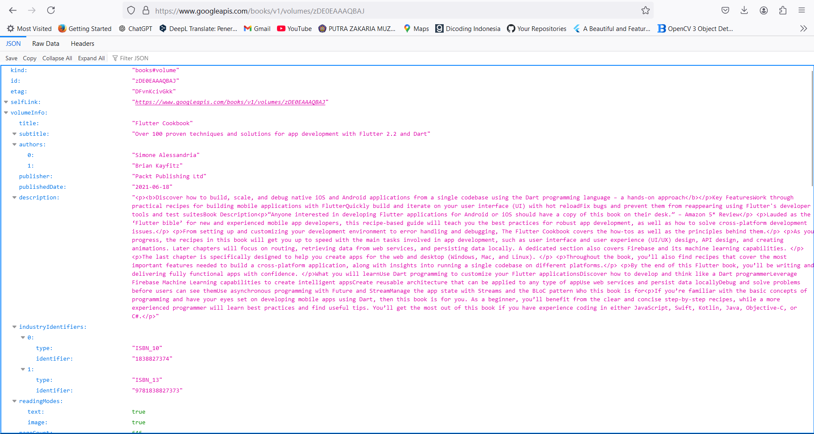
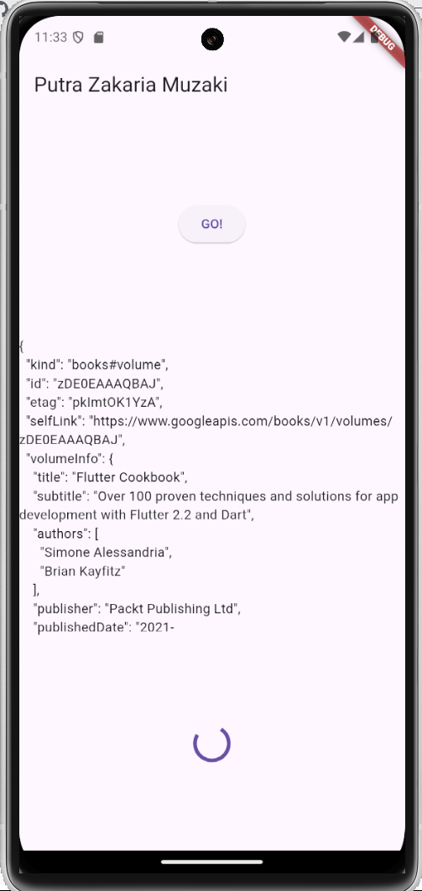

# books

A new Flutter project.

## Getting Started

**Soal 1: Tambahkan nama panggilan Anda pada title app sebagai identitas hasil pekerjaan Anda.**
```
    appBar: AppBar(
        title: const Text('Putra Zakaria Muzaki'),
      ),
``` 

**Soal 2: Carilah judul buku favorit Anda di Google Books, lalu ganti ID buku pada variabel path di kode tersebut. Kemudian cobalah akses di browser URI tersebut**



**Soal 3: Jelaskan maksud kode langkah 5 tersebut terkait substring dan catchError!**

- ```substring```: digunakan untuk mengambil sebagian teks berdasarkan indeks karakter yang ditentukan. Pada kode yang menggunakan ```.substring(0, 450)```, artinya teks yang diambil dimulai dari karakter pertama (indeks 0) hingga karakter ke-450 (tidak termasuk karakter ke-450).
- ```catchError```: digunakan untuk menangkap dan menangani error yang terjadi saat suatu operasi gagal, seperti kegagalan dalam mendapatkan data. Ketika error terjadi, pesan seperti "An error occurred" dapat ditampilkan sebagai respons.



**Soal 4: Jelaskan maksud kode langkah 1 dan 2 tersebut!**

- ```langkah 1```: Pada langkah ini dilakukan proses pendeklarasian fungsi async yang mengembalikan nilai integer, dimana pada setiap fungsinya terdapat code ```Future.delayed``` yang digunakan untuk menunggu dalam durasi tertentu sebelum mengembalikan nilai.
- ```langkah 2```: Pada langkah ini dilakukan proses pendeklarasian fungsi async yang digunakan untuk menghitung jumlah nilai yang dikembalikan dari ketiga fungsi yang dideklarasikan pada langkah 1, dimana pada code ini menggunakan perintah await yang menyebabkan code dijalankan secara berurutan dan akan menunggu 3 detik sebelum melanjutkan ke fungsi selanjutnya. Hasil akhirnya diassign ke variabel global (atau state) result untuk diperbarui di UI.


**Soal 5: Jelaskan maksud kode langkah 2 tersebut!**

Pada langkah 2 terjadi proses pendeklarasian 2 fungsi, yaitu:
- ```getNumber()```: digunakan untuk mengembalikan sebuah Future yang akan selesai (completed) ketika proses async di fungsi calculate selesai. Dimana didalam fungsi terjadi proses instance Completer<int>, yang akan mengontrol penyelesaian (completion) dari Future, proses pemanggilan fungsi calculate dan pengembalian nilai future yang akan diselesaikan oleh complementer.
- ```calculate()```: digunakan untuk menjalankan operasi asynchronous yang tertunda selama 5 detik, lalu menyelesaikan Future yang dikontrol oleh Completer dan mengisi nilai future dengan 42.


**Soal 6: Jelaskan maksud perbedaan kode langkah 2 dengan langkah 5-6 tersebut!**

Pada langkah 5 dan 6 terjadi penambahan untuk logika error handling, misal jika terjadi kesalahan, Completer dapat diselesaikan dengan error menggunakan ```completer.completeError().```, dan hasilnya error akan ditangkap di catchError dan UI menampilkan pesan "An error occurred".


**Soal 7: Capture hasil praktikum Anda berupa GIF dan lampirkan di README**


**Soal 8: Jelaskan maksud perbedaan kode langkah 1 dan 4!**

- ```Langkah 1```: Pada langkah ini menggunakan FutureGroup yang biasanya digunakan untuk mendapatkan fleksibilitas untuk menambahkan Futures secara dinamis sebelum mengeksekusinya. Contoh: Mengelola daftar tugas async yang jumlahnya berubah saat runtime.
- ```Langkah 4```: Pada langkah ini menggunakan Future.wait yang biasanya digunakan untuk situasi sederhana di mana semua Futures sudah diketahui sejak awal. Contoh: Menjalankan beberapa operasi async yang telah didefinisikan.