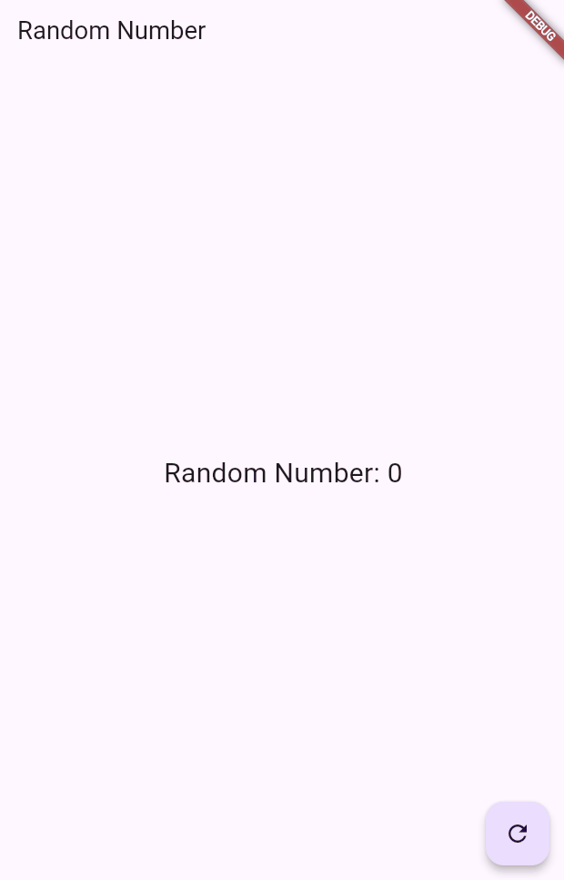

# Minggu 12 Random BLOC

## Nama: Putra Zakaria Muzaki
## Kelas: TI-3H
## Absen: 19

### Soal 13: Jelaskan maksud praktikum ini ! Dimanakah letak konsep pola BLoC-nya ?

Praktikum ini bertujuan untuk memberikan pemahaman kepada peserta tentang cara mengimplementasikan pola arsitektur BLoC (Business Logic Component) di aplikasi Flutter. Konsep BLoC digunakan untuk memisahkan logika bisnis dari tampilan (UI), sehingga menciptakan kode yang lebih modular, mudah diuji, dan dapat di-reuse.

Letak Konsep Pola BLoC

1. BLoC sebagai Komponen Logika Bisnis
    - `RandomNumberBloc` bertindak sebagai lapisan logika bisnis yang terpisah dari UI. Di dalamnya terdapat `StreamController` untuk mendefinisikan aliran data.
    - Input: Aliran perintah dari UI (melalui `Sink<void>` pada `_generateRandomController`).
    - Output: Aliran data hasil pengolahan logika (melalui `Stream<int>` pada `_randomNumberController`).

2. Penggunaan Stream untuk Komunikasi
    - Data yang dihasilkan (angka acak) dikirimkan melalui stream `_randomNumberController`.
    - Komunikasi antara UI dan logika bisnis terjadi secara reaktif melalui aliran data.

3. Integrasi BLoC dengan UI
    - `StreamBuilder<int>` di RandomScreen mendengarkan aliran data (randomNumber) dari BLoC.
    - Setiap kali ada data baru dalam stream, StreamBuilder memperbarui UI dengan angka acak terbaru.

4. Pemrosesan Input
    - Ketika tombol floating action button ditekan, perintah dikirimkan ke BLoC melalui `generateRandom.add(null)`.
    - BLoC memproses perintah dengan mendengarkan aliran `_generateRandomController.stream` dan menghasilkan angka acak.

5. Pemisahan Tugas
    - Logika bisnis (generasi angka acak) ada di `RandomNumberBloc`.
    - Tugas UI terbatas pada menampilkan data dari stream dan menangkap interaksi pengguna.

