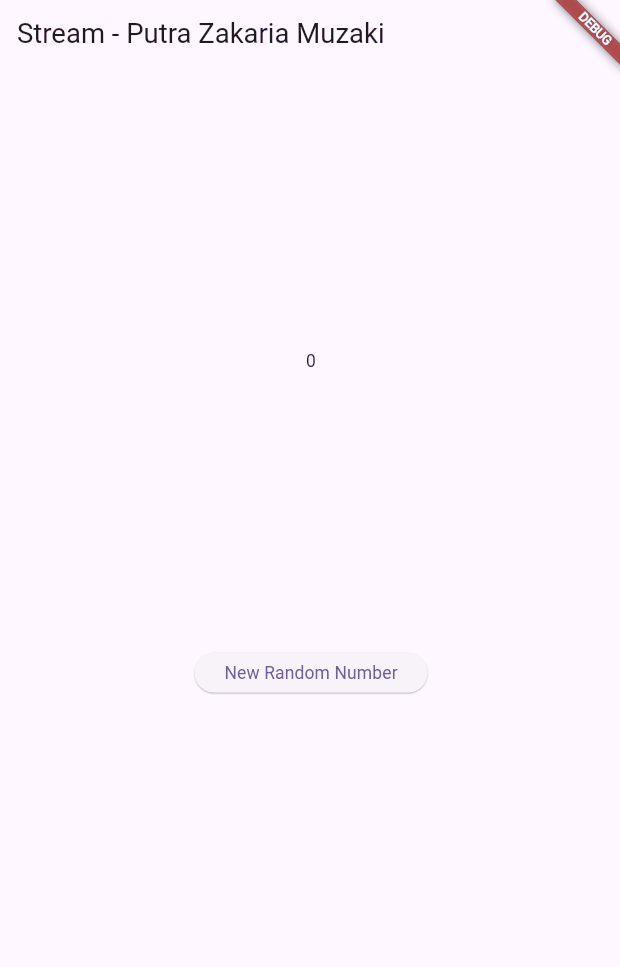

# Minggu 12 Stream

## Nama: Putra Zakaria Muzaki
## Kelas: TI-3H
## Absen: 19

### Soal 1: Tambahkan nama panggilan Anda pada title app sebagai identitas hasil pekerjaan Anda. Gantilah warna tema aplikasi sesuai kesukaan Anda.

Perubahan code untuk mengganti title dan warna tema aplikasi:
```
  Widget build(BuildContext context) {
    return MaterialApp(
      title: 'Stream - Putra Zakaria Muzaki',
      theme: ThemeData(primarySwatch: Colors.lime),
      home: const StreamHomePage(),
    );
  }
```

### Soal 2: Tambahkan 5 warna lainnya sesuai keinginan Anda pada variabel colors tersebut.

Perubahan code untuk menambahkan warna:
```
class ColorStream {
  final List<Color> colors = [
    Colors.blueGrey,
    Colors.amber,
    Colors.deepPurple,
    Colors.lightBlue,
    Colors.teal,
    // Add 5 color
    Colors.pink,
    Colors.lime,
    Colors.green,
    Colors.orange,
    Colors.purple,
  ];
}
```

### Soal 3: Jelaskan fungsi keyword yield* pada kode tersebut! Apa maksud isi perintah kode tersebut

a. Fungsi yield* digunakan untuk menggabungkan stream kedalam stream yang dibuat oleh generator, dimana fungsi yield* akan mengalirkan semua elemen dari sumber stream ke output stream. <br>
b. Kode ini membuat sebuah stream yang secara otomatis mengirimkan warna dari daftar warna dalam ColorStream secara bergantian, satu per satu setiap detik. Stream ini berputar secara siklis, kembali ke warna pertama setelah mencapai warna terakhir di daftar.

### Soal 4: Capture hasil praktikum Anda berupa GIF dan lampirkan di README


### Soal 5: Jelaskan perbedaan menggunakan listen dan await for (langkah 9)!

a. `listen` digunakan untuk memasang callback pada stream secara asinkron". Artinya, setiap kali stream menghasilkan data baru, callback dengan `listen` akan dipanggil untuk memproses data tersebut.<br>
b. `await for` digunakan untuk menunggu setiap elemen dari stream secara sinkron". Ini berarti eksekusi akan berhenti sementara untuk menunggu elemen berikutnya dari stream, dan setiap elemen diproses satu per satu dalam urutan.

### Soal 6: Jelaskan maksud kode langkah 8 dan 10 tersebut!

langkah 8:
```
  void initState() {
    numberStream = NumberStream();
    numberStreamController = numberStream.controller;
    Stream stream = numberStreamController.stream;
    stream.listen((event) {
      setState(() {
        lastNumber = event;
      });
    });
    super.initState();
  }
```
Code ini digunakan untuk mengatur stream dan mendapatkan perubahan data menggunakan listen, sehingga ketika data baru diterima nilai dari `lastNumber` akan diperbarui.

langkah 10:
```
  void addRandomNumber() {
    Random random = Random();
    int myNum = random.nextInt(10);
    numberStream.addNumberToSink(myNum);
  }
```
Code ini digunakan untuk menghasilkan angka secara acak dari 0-9 ketika method yang dipanggil, kemudian memanggil method addNumberToSink untuk mengirim angka acar kedalam stream.

