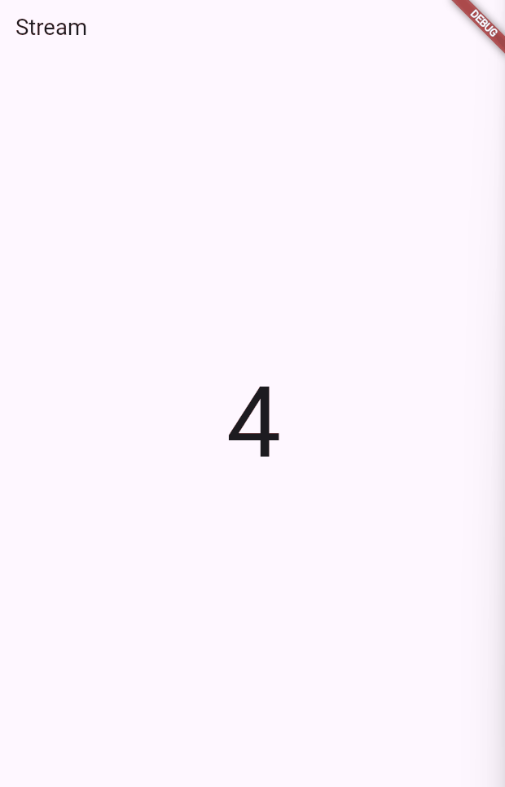

# Minggu 12 Stream Builder

## Nama: Putra Zakaria Muzaki
## Kelas: TI-3H
## Absen: 19

### Soal 12: Jelaskan maksud kode pada langkah 3 dan 7 !

langkah 3:
```
import 'dart:math';

class NumberStream {
  Stream<int> getNumbers() async* {
    yield* Stream.periodic(const Duration(seconds: 1), (int t) {
      Random random = Random();
      int myNum = random.nextInt(10);
      return myNum;
    });
  }
}
```
Pada langkah ini dilakukan proses deklarasi fungsi `getNumbers()` yang dimana digunakan untuk membuat stream yang menghasilkan angka random dari 0-9 setiap satu detiknya secara terus menerus melalui `Stream.periodic()`.

langkah 7:
```
body: StreamBuilder(
stream: numberStream,
initialData: 0,
builder: (context, snapshot) {
    if (snapshot.hasError) {
        print('Error!');
    }
    if (snapshot.hasData) {
        return Center(
            child: Text(
                snapshot.data.toString(),
                style: const TextStyle(fontSize: 96),
            ),
        );
    } else {
        return const SizedBox.shrink();
    }
})
```
Pada langkah 7 dilakukan implementasi UI yang dinamis menggunakan StreamBuilder, sehingga angka acak dari numberStream ditampilkan di layar secara real-time.

