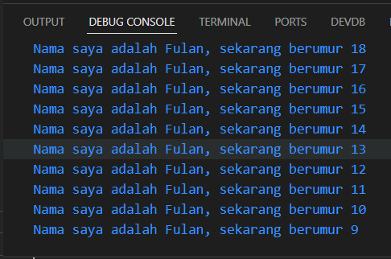

# **Pengantar Bahasa Pemrograman Dart - Bagian 1**

## Nama : Putra Zakaria Muzaki
## Kelas : TI-3H/19
## NIM : 2241720220 

<br>

**Soal 1**
<br> &emsp; Modifikasilah kode pada baris 3 di VS Code atau Editor Code favorit Anda berikut ini agar mendapatkan keluaran (output) sesuai yang diminta!
<br>Output yang diminta:
<br>


Jawaban:<br>
```
void main(List<String> args) {
  for (var i = 18; i >= 9; i--) {
    print('Nama saya adalah Fulan, sekarang berumur ${i}');
  }
}
```
Hasil Run:


**Soal 2**
<br> &emsp; Mengapa sangat penting untuk memahami bahasa pemrograman Dart sebelum kita menggunakan framework Flutter ? Jelaskan!

Jawaban:<br>
```
Karena Flutter adalah framework dari Dart, dimana pastinya Dart adalah inti dari framework Flutter, sehingga untuk memahami bahasa pemrograman Dart akan mempermudah untuk memahami cara kerja Flutter.  
```

**Soal 3**
<br> &emsp; Rangkumlah materi dari codelab ini menjadi poin-poin penting yang dapat Anda gunakan untuk membantu proses pengembangan aplikasi mobile menggunakan framework Flutter.

Jawaban:<br>
```
Bahasa Dart adalah inti dari framework Flutter. 

a. Fitur Utama Dart:
  - Productive tooling: Mendukung IDE dengan plugin, analisis kode, dan ekosistem paket yang besar.
  - Garbage collection: Menangani dealokasi memori secara otomatis.
  - Type annotations (opsional): Memberikan keamanan tipe data, sehingga tidak ada variabel tidak terpakai yang akan memakan memori.
  - Statically typed: Menggunakan type-safe dan type inference untuk memastikan keamanan tipe data dan meminimalisasi bug.
  - Portability: Bisa dikompilasi ke JavaScript, ARM, dan x86, sehingga mendukung berbagai platform.

b. Cara Kerja Dart
```

```
 Untuk mengeksekusi kode Dart dapat dilakukan dengan dua cara, yaitu:
 - Dart VM: Digunakan langsung dalam lingkungan seperti Android Studio.
 - dart2js: Kode Dart dikonversi terlebih dahulu menjadi JavaScript agar dapat dijalankan di web browser.
 
 Adapun kode dart dapat beroperasi dalam dua mode:
 - Just-In-Time (JIT) Compilation: Kode Dart dikompilasi saat runtime, sehingga memungkinkan fitur seperti debugging dan hot reload selama pengembangan aplikasi.
 - Ahead-Of-Time (AOT) Compilation: Kode Dart dikompilasi sebelumnya menjadi kode mesin asli (native).

c. Operator Dart
  Di Dart, operator tidak lebih dari method yang didefinisikan dalam class dengan sintaks khusus. Jadi, ketika menggunakan operator seperti x == y, seolah-olah Anda sedang memanggil x.==(y).

  1. Operator Arithmetic:
    a. + untuk tambahan.
    b. - untuk pengurangan.
    c. * untuk perkalian.
    d. / untuk pembagian.
    f. ~/ untuk pembagian bilangan bulat
    g. % untuk operasi modulus (sisa bagi dari bilangan bulat).
    h. -expression untuk negasi (yang membalikkan suatu nilai).

  2. Operator Increment Decrement:    
    a. ++var atau var++ untuk menambah nilai variabel var sebesar 1
    b. --var atau var-- untuk mengurangi nilai variabel var sebesar 1


  3. Equality and relational operators:
    a. == untuk memeriksa apakah operan sama
    b. != untuk memeriksa apakah operan berbeda
    c. > memeriksa apakah operan kiri lebih besar dari operan kanan
    d. < memeriksa apakah operan kiri lebih kecil dari operan kanan
    e. >= memeriksa apakah operan kiri lebih besar dari atau sama dengan operan kanan
    f. <= memeriksa apakah operan kiri kurang dari atau sama dengan operan kanan

  4. Logical operators:    
    a. !expression negasi atau kebalikan hasil ekspresi—yaitu, true menjadi false dan false menjadi true.
    b. || menerapkan operasi logika OR antara dua ekspresi.
    c. && menerapkan operasi logika AND antara dua ekspresi.

```
