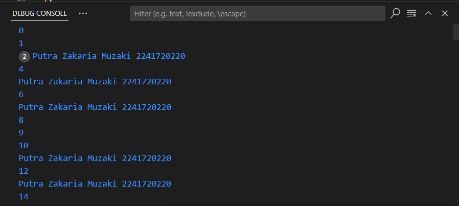

# **Pengantar Bahasa Pemrograman Dart - Bagian 2**

## Nama : Putra Zakaria Muzaki
## Kelas : TI-3H/19
## NIM : 2241720220 

<br>

**Soal 1**
<br> &emsp; Silakan selesaikan Praktikum 1 sampai 3, lalu dokumentasikan berupa screenshot hasil pekerjaan beserta penjelasannya!

Jawaban:<br>
**Praktikum 1:**
```
Pada langkah 1 ada error karena dart menggunakan key sensitive, dan pada saat menuliskan pengondisian if else untuk "else if" dituliskan "else If" dimana akan terjadi error karena huruf i-nya kapital dan untuk "else" dituliskan "Else" dimana akan terjadi error karena huruf e-nya kapital. Selanjutnya untuk kode tambahan pada langkah 3 terjadi error karena variabel test sudah didefinisikan sebelumnya, jadi jika ingin mengganti isinya tidak perlu menuliskan tipe datanya terlebih dahulu dan didalam pengkondisian bisa ditambahkan kode untuk mengecek isi variabel. Untuk kode tambahan pada langkah 3 juga bisa digantikan tipe datanya menjadi boolean mengatasi error.
```
**Praktikum 2:**
```
Pada langkah 1 ada error karena untuk variabel counter belum didefinisikan sebelumnya, jadi untuk memperbaiki code bisa dilakukan dengan cara menambahkan pendefisian variabel counter dengan menambahkan valuenya. Dan untuk kode tambahan pada lanhkah 3 tidak terjadi error karena permasalahannya yaitu pada pendefinisian variabel counter sudah dilakukan.
```
**Praktikum 3:**
```
Pada langkah 1 ada error karena dart menggunakan key sensitive dimana pada perulangan untuk condition dan increment/decrementnya menggunakan variabel "index" tetapi variabel yang didefinisikan "Index", sehingga untuk memperbaiki error bisa dilakukan dengan cara mengubah variabel yang digunakkan menjadi "Index" dan untuk increment/decrementnya bisa digantikan dengan increment menjadi "Index++". Untuk kode tambahan pada langkah 3 terjadi error karena untuk pengondisiannya tidak ada "{}" sehingga yang dieksekusi hanya baris pertama dan untuk "else if"-nya juga dituliskan "Else If" sehingga perlu perbaikan menjadi "else if". 
```
**Soal 2**
<br> &emsp; Buatlah sebuah program yang dapat menampilkan bilangan prima dari angka 0 sampai 201 menggunakan Dart. Ketika bilangan prima ditemukan, maka tampilkan nama lengkap dan NIM Anda.

Jawaban:<br>
```
void main(List<String> args) {
  for (var i = 0; i <= 201; i++) {
    if (cekPrima(i)) {
      print("Putra Zakaria Muzaki 2241720220");
    } else {
      print(i);
    }
  }
}

Function cekPrima = (int number) {
  if (number == 0 || number == 1) {return false;}
  
  for (var i = 2; i < number; i++) {
    if (number % i == 0) {return false;}
  }
  
  return true;
};
```
Output:<br>
Hasilnya akan mencetak bilangan dari 0-201 dan untuk bilangan prima akan digantikan dengan nama dan nim.

