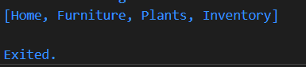
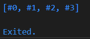

# **Pengantar Bahasa Pemrograman Dart - Bagian 3**

## Nama : Putra Zakaria Muzaki
## Kelas : TI-3H/19
## NIM : 2241720220 

<br>

**Soal 1**
<br> &emsp; Silakan selesaikan Praktikum 1 sampai 5, lalu dokumentasikan berupa screenshot hasil pekerjaan Anda beserta penjelasannya!

Jawaban:<br>
**Praktikum 1:**
```
Pada langkah 1 tidak terjadi error dan menampilkan output: 
```

```
Angka 3 adalah nilai dari panjang list, angka 2 adalah nilai list pada index ke-1 dan angka 1 juga nilai pada index ke-1 namun nilainya telah berubah oleh kode: list[1] = 1;
```
**Praktikum 2:**
```
Tidak ada kesalahan pada langkah 1, dan pendeklarasian set juga berhasil karena sudah ada nilainya. Namun untuk membedakan dengan maps code bisa diperbaiki menjadi 
  var halogens = <String>{'fluorine', 'chlorine', 'bromine', 'iodine' 'astatine'};
output: 
```

```
Untuk Langkah 3 ketika dicek tipedatanya akan menampilkan:
```

```
Untuk names1 dan names2 berhasil mendeklarasikan set, namun untuk names3 mendeklarasikan maps. dan untuk menambahkan data menggunakan .add() dan .addAll() dilakukan melalui kode berikut:

  names1.add("Putra Zakaria Muzaki");
  names1.add("2241720220");
  names2.addAll(names1);
```
**Praktikum 3:**
```
Pada langkah 1 tidak terjadi error. Terjadi proses pendeklarasian Maps pada Langkah 1, yaitu maps gifts yang menggunakan key string dan nobleGases yang menggunakan key int
output: 
```

```
Pada langkah 3 tidak terjadi error, namun terjadi pendeklarasian Maps mhs1 dan mhs2 serta pengubahan data untuk maps gifts dan nobleGases. Dan untuk menambahkan elemen Nama dan NIM pada tiap variabel maps dilakukan melalui code:

  gifts['sixth'] = 'Putra Zakaria Muzaki';
  gifts['seventh'] = '2241720220';

  nobleGases[19] = 'Putra Zakaria Muzaki';
  nobleGases[20] = '2241720220';

  mhs1['first'] = 'Putra Zakaria Muzaki';
  mhs1['second'] = '2241720220';

  mhs2[1] = 'Putra Zakaria Muzaki';
  mhs2[2] = '2241720220';

Sehingga jika dicetak nilai setiap variabel menampilkan:
```

**Praktikum 4:**
```
Terjadi error pada langkah 1 karena yang dicetak adalah list1 namun variabel yang dideklarasikan adalah list, sehingga perlu dilakukan perbaikan berupa mengganti nama variabel menjadi list1. Dan untuk list2 telah menggunakan spread operator(...) dimana nilai dari list1 akan dimasukkan ke variabel list2. Hasilnya:
```

```
Pada langkah 3 juga terjadi error karena list 1 bertipe int sehingga tidak bisa ditambahkan nilai null. '...?' digunakan untuk menambahkan nilai menggunakan spread operator, namun jika terdapat data null maka data tidak akan ditambahkan. Dan untuk menambahkan NIM saya menghapus null menjadi Nim saya:
list1 = [1, 2, 2241720220];
sehingga didapatkan hasil:
```

```
Terjadi error pada langkah 4 karena belum ada pendeklarasian variabel promoActive. Hasil ketika sudah dilakukan pendeklarasian variabel promoActive:
```

```
Hasilnya Outlet akan disimpan jika nilai dari promoActive true, dan Outlet tidak akan disimpan jika nilai dari promoActive false dimana untuk mengaturnya menggunakan fitur collection if
```
```
Terjadi error pada langkah 5 karena belum ada pendeklarasian variabel login. Pada langkah 5 ini hampir sama dengan langkah 4, namun bedanya pada langkah 5 ini menggunakan collection if-case untuk menyimpan 'Inventory'. Hasil ketika sudah dilakukan pendeklarasian variabel login:
```

```
Tidak terjadi error pada langkah 6, yang terjadi adalah penambahan data dari listOfInts ke dalam listOfStrings dengan collection for melalui code for (var i in listOfInts), sehingga elemen dari listOfInts (1, 2, 3) di-loop, dan setiap elemen digabungkan dengan string # untuk membuat elemen baru seperti #1, #2, dan #3. Hasilnya:
```

**Praktikum 5:**
```
Terjadi error pada langkah 1 karena tidak adanya ; pada akhir perintah print. Diluar itu telah terjadi pendeklarasian record yang bisa menampung berbagai jenis objek menjadi 1 objek. Output:
```

```
Pada langkah 3 terjadi pendeklarasian fungsi tukar yang digunakan untuk menukar urutan nilai dari variabel dengan tipe data int. Dan untuk menggunakan fungsinya bisa dilakukan melalui kode:
  var ori = (1, 2);
  var swp = tukar(ori);
Hasilnya: (posisi nilai akan tertukar)
```

```
Pada Langkah 4 terjadi erro karena variabel mahasiswa masih bersifat null, sehingga tidak bisa dicetak. Berikut code jika variabel mahasiswa diisikan dengan nama dan nim:
(String, int) mahasiswa;
  mahasiswa = ('Putra Zakaria Muzaki', 2241720220);
Outputnya:
```

```
Pada langkah 5 tidak terjadi error, namun terjadi pemanggilan record dengan menggunakan key dan indeks, untuk nilai yang memiliki key tidak akan dihitung indeksnya, contohnya indeks 1 adalah 'first' namun indeks ke-2 bukan 2 karena 2 sudah memiliki key a sehingga indeks ke-2 dimiliki oleh 'last'. untuk mengubah data harus dilakukan pada saat pendeklarasian karena record bersifat immutable, berikut codenya:
  var mahasiswa2 = ('Putra Zakaria Muzaki', a: 2241720220, b: true, 'last');
Outputnya:
```


**Soal 2**
<br> &emsp; Jelaskan yang dimaksud Functions dalam bahasa Dart!
Jawaban:<br>
```
Functions adalah blok kode yang dapat digunakan kembali untuk melakukan tugas tertentu. Fungsi dapat menerima input, yang dikenal sebagai parameter, dan bisa mengembalikan output dalam bentuk nilai. 
```

**Soal 3**
<br> &emsp; Jelaskan jenis-jenis parameter di Functions beserta contoh sintaksnya!
Jawaban:<br>

**Positional Parameter**
Parameter yang didefinisikan dalam urutan tertentu saat fungsi dipanggil. Pengguna harus memberikan nilai untuk setiap parameter dalam urutan yang sama seperti yang didefinisikan.
```
void positionalParameters(String nama, int nim) {
  print("Nama saya $nama, dan nim saya $nim");
}

positionalParameters("Putra Zakaria", 2241720220); // Output Nama saya Putra Zakaria, dan nim saya 2241720220
```

**Optional Positional Parameter**
Parameter yang ditandai dengan tanda kurung siku []. Parameter ini bersifat opsional, dan jika tidak diberikan nilai, maka akan menggunakan null (jika tidak didefinisikan dengan nilai default).
```
void optionalPositionalParameters([String? name, int? nim]) {
  print("Nama saya $name, dan nim saya $nim");
}

optionalPositionalParameters("Putra Zakaria"); // Output Nama saya Putra Zakaria, dan nim saya null
```

**Optional Named Parameter**
Parameter yang didefinisikan dengan nama dan ditandai dengan kurung kurawal {}. Parameter ini juga bersifat opsional, dan jika tidak diberikan nilai, akan menggunakan nilai default (jika didefinisikan).
```
void optionalNamedParameters({String? name = "Guest", int? nim = 0}) {  
  print("Nama saya $name, dan nim saya $nim");
}

optionalNamedParameters(); // Output Nama saya Guest, dan nim saya 0
```

**Soal 4**
<br> &emsp; Jelaskan maksud Functions sebagai first-class objects beserta contoh sintaknya!
Jawaban:<br>
Dalam Dart, fungsi dianggap sebagai first-class objects, yang berarti Fungsi bisa disimpan dalam variabel, Fungsi bisa dilewatkan sebagai parameter ke fungsi lain, dan Fungsi bisa dikembalikan dari fungsi lain.
```
void printMessage() {
  print('Hello World');
}

void executeFunction(void Function() func) {
  func();  
}

void main() {
  var func = printMessage;
  executeFunction(func); // Output Hello World
}
```

**Soal 5**
<br> &emsp; Apa itu Anonymous Functions? Jelaskan dan berikan contohnya!
Jawaban:<br>
Fungsi tanpa nama yang sering digunakan dalam situasi di mana kita membutuhkan fungsi sekali pakai
```
var numbers = [1, 2, 3, 4];
var doubled = numbers.map((n) => n * 2).toList();
print(doubled); // Output: [2, 4, 6, 8]
```

**Soal 6**
<br> &emsp; Jelaskan perbedaan Lexical scope dan Lexical closures! Berikan contohnya!
Jawaban:<br>
*Lexical Scope:* Lingkup di mana variabel dideklarasikan dan dapat diakses dalam suatu blok kode atau fungsi.
```
void main(List<String> args) {
  var outerVariabel ='Hello';
  void innerFunction(){
    print(outerVariabel); // outerVariabel bisa diakses
  }
}
```
*Lexical Closures:*  fungsi dalam Dart yang dapat mengingat lingkup di mana mereka didefinisikan, bahkan setelah lingkup tersebut berakhir.
```
Function makeCounter() {
  int count = 0;  // Variabel dari lingkup luar
  return () {
    count++;  // Mengakses dan mengubah variabel count
    return count;  // Mengembalikan nilai count yang telah di-increment
  };
}

var counter = makeCounter();  // Membuat counter pertama
  print(counter());  // Output: 1
  print(counter());  // Output: 2
```

**Soal 7**
<br> &emsp; Jelaskan dengan contoh cara membuat return multiple value di Functions!
Jawaban:<br>
Dart tidak mendukung pengembalian beberapa nilai secara langsung seperti beberapa bahasa lain, tetapi kita bisa menggunakan records, array, atau map untuk membuat return multiple value
```
List getDetails() {
  return [19, 'Putra'];
}

void main() {
  var details = getDetails();
  print('ID: ${details[0]}, Nama: ${details[1]}');
}
```